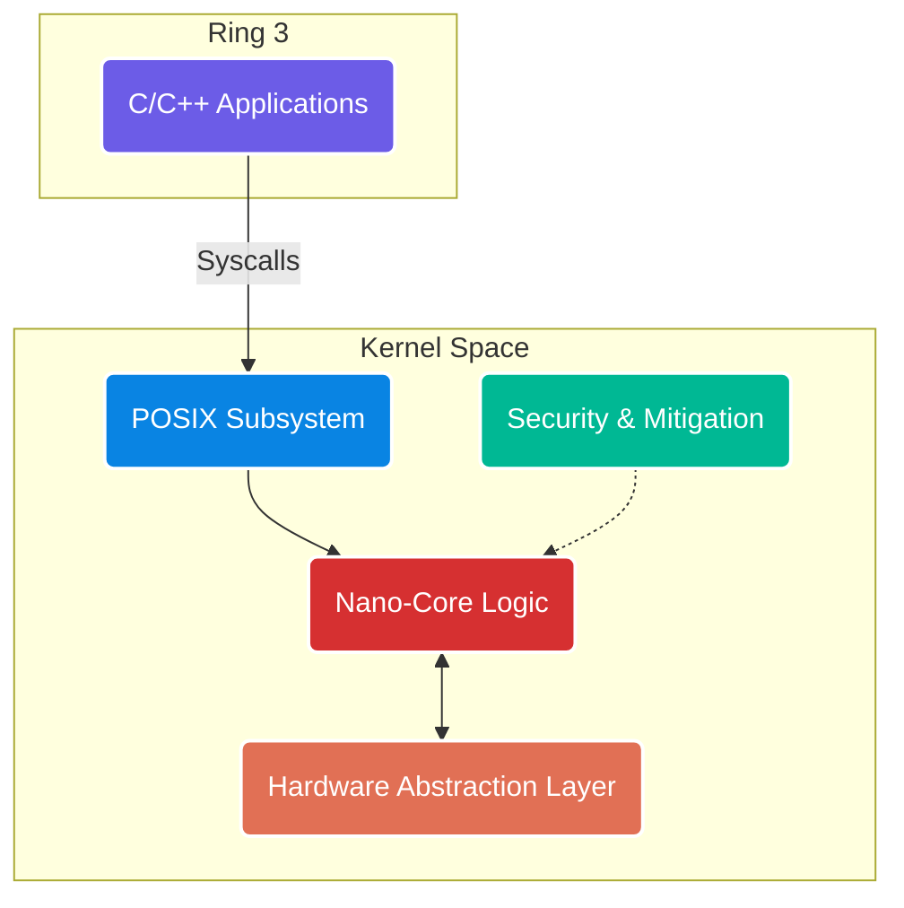

<div align="center">
  
  
  <h1 style="color: #6C5CE7; font-size: 3em; margin-bottom: 0;">USYA</h1>
  <h3 style="color: #00CEC9;">The Hybrid Nano-Core</h3>
  <br />
  
  <p style="font-size: 1.2em; max-width: 600px; margin: 0 auto; line-height: 1.6;">
    <strong>Engineered for <span style="color:#FF7675;">Dhrishti OS</span>.</strong><br/>
    <em>Bypassing the monolithic bloat of Linux and the legacy debt of XNU.</em>
  </p>
  <br/>
  
  <p>
    
    
    
    
  </p>
</div>

---

## 🦅 Mission Statement

<table width="100%">
  <tr>
    <td width="70%">
      <b>Usya</b> is a next-generation <b>Hybrid Nano-Core</b>, designed to deliver unprecedented speed, security, and hardware isolation. Built entirely in bare-metal Rust (<code>#![no_std]</code>), Usya eliminates legacy cruft by compartmentalizing the Hardware Abstraction Layer (HAL), the Universal Driver Framework (UDF), and POSIX compatibility into ultra-fast, isolated modules.
      <br/><br/>
      <em>Lead Architect:</em> <strong>GRAY (Santhosh P)</strong>
    </td>
    <td width="30%" align="center">
      <h1 style="font-size: 4em; margin: 0;">🛡️</h1>
      <b>Secure by Design</b>
    </td>
  </tr>
</table>

---

## 🏗️ Phase 3: Architectural Topology

The Usya Workspace has successfully transitioned into Phase 3, establishing the foundational architecture for the Universal Driver Ecosystem. 

> [!NOTE]
> **Why Hybrid Nano-Core?** We combine the speed of a monolithic kernel with the security and fault-tolerance of a microkernel.

### 🌌 USYA ENTERPRISE



### ⚡ UNIVERSAL DRIVER ECOSYSTEM

| Component | Description | Status |
| :--- | :--- | :---: |
| 💽 **`drivers/storage`** | NVMe / AHCI Storage Protocols | 🟡 |
| 🔌 **`drivers/usb`** | XHCI / HID Controllers | 🟡 |
| 🌐 **`drivers/network`** | NIC / Wi-Fi Stack | 🔴 |
| 🎮 **`drivers/gpu`** | DRM / Framebuffer Rendering | 🟢 |

---

## 📂 Directory Structure

<details open>
<summary><b>System Cores</b></summary>

- 🟥 **`/boot`**: Final binary executable linking the workspace, generating `bootimage-usya.bin`.
- 🟪 **`/kernel`**: The bare-metal Hybrid Nano-Core logic.
- 🟦 **`/hal`**: Architectural boundaries, CPU-specific intrinsics, and IO operations.
- 🟨 **`/posix`**: User-space translation layer for POSIX-compliant system calls.
- 🟩 **`/security`**: Built-in execution policies, stack protection, and capability-based access.

</details>

<details open>
<summary><b>Driver Subsystems</b></summary>

- 💾 **`/drivers/storage`**: NVMe & AHCI storage stacks.
- 🖱️ **`/drivers/usb`**: USB protocol parsing and HID device management.
- 📡 **`/drivers/network`**: Network interface controllers and wireless abstractions.
- 🖥️ **`/drivers/gpu`**: Direct Rendering Manager and framebuffer abstractions.
- ⚙️ **`/xtask`**: Custom pipeline generating OS boot images safely and deterministically.

</details>

---

## 🚀 Build Instructions

USYA requires a **nightly Rust compiler** to build its core and compiler built-ins for the `x86_64-unknown-none` target.

### 🧹 1. Clean Environment
Ensure the directory is free of locks by stopping rust-analyzer or pausing Windows Defender.
```bash
cargo clean
```

### 🛠️ 2. Generate Boot Image
Build the Nano-Core and package it into BIOS & UEFI images in `target/bootimage/`.
```bash
cargo xtask
```

### 🖥️ 3. Execute in QEMU
Run the newly created image in the QEMU emulator:
```bash
qemu-system-x86_64 -drive format=raw,file=target/bootimage/bootimage-bios.bin -machine q35 -vga std -serial stdio
```

<br/>
<div align="center">
  <sub>Built with 🦀 Rust & ❤️ for the Future of Operating Systems</sub>
</div>
